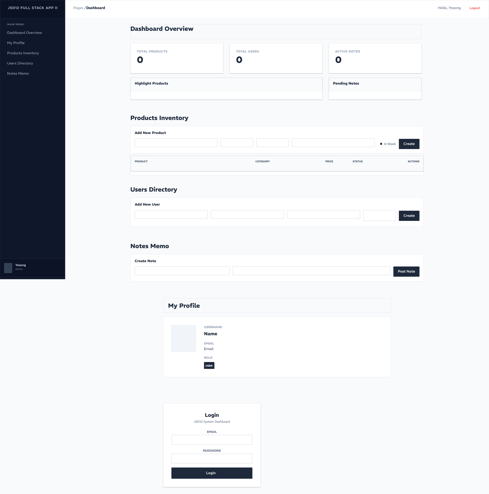

# JSD12 Week12 | Full Stack App (Frontend) II

Backend Repo: https://github.com/weerayosong/jsd12-full-stack-app-be (Branch: phase-06_bcrypt)

## Software Architecture Diagram

React App (Frontend UI)
https://miro.com/app/board/uXjVHPZzDKc=/?share_link_id=896228414033

## Concept UI Design

## User Dashboard with API Server

- All CRUD Routes from Users, Products, and Notes.
- MongoDB.
- Bcrypt.
- Full Authentication routes and controllers.

## Overview

- A single-screen dashboard built with **React**, **Vite**, and **Tailwind CSS v4** to test front-end integration with MongoDB database.
- Connects to an Express API server running locally on port 3002.
